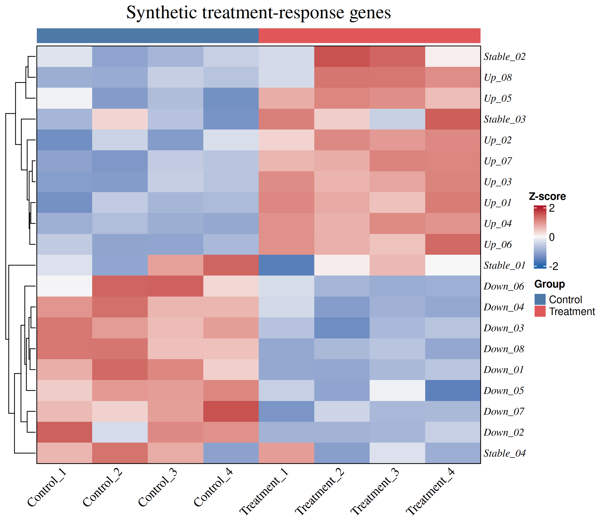

# 用 `Heatmap_plot()` 绘制带样本分组的表达热图

本教程会生成一组模拟的基因表达数据，并使用 `BioInfoAfterSale::Heatmap_plot()` 绘制热图。完成后，你会得到一张带有样本分组、行 Z-score、基因聚类和图例的 PNG 图片。

所有字体优先使用 `Times New Roman`。聚类树支持默认层级聚类和显式按欧几里得距离构建的聚类树。

> 本教程中的数据完全由 R 模拟，仅用于演示函数调用，不代表真实生物学实验。

## 准备工作

需要 R 4.2.0 或更高版本。首次使用时，从 GitHub 安装 R 包：

```r
if (!requireNamespace("remotes", quietly = TRUE)) {
  install.packages("remotes")
}

remotes::install_github("DengXinyin/BioInfo_AfterSale")
```

载入包，并创建结果目录：

```r
library(BioInfoAfterSale)

dir.create("heatmap_results", showWarnings = FALSE)
```

`Heatmap_plot()` 不会自动创建输出目录，因此需要先运行 `dir.create()`。

## 第 1 步：生成模拟表达矩阵

下面生成 20 个基因和 8 个样本。前 4 个样本属于对照组，后 4 个属于处理组。处理组中，8 个基因被设为升高，另外 8 个被设为降低，剩余 4 个没有预设处理效应。

```r
set.seed(20260816)

sample_ids <- c(
  paste0("Control_", 1:4),
  paste0("Treatment_", 1:4)
)

gene_ids <- c(
  paste0("Up_", sprintf("%02d", 1:8)),
  paste0("Down_", sprintf("%02d", 1:8)),
  paste0("Stable_", sprintf("%02d", 1:4))
)

expression_matrix <- matrix(
  rnorm(length(gene_ids) * length(sample_ids), mean = 8, sd = 0.45),
  nrow = length(gene_ids),
  dimnames = list(gene_ids, sample_ids)
)

# 为处理组加入两种相反方向的模拟变化。
expression_matrix[1:8, 5:8] <- expression_matrix[1:8, 5:8] + 2.2
expression_matrix[9:16, 5:8] <- expression_matrix[9:16, 5:8] - 2.2
```

矩阵的行是基因，列是样本。可以先检查前几行：

```r
round(expression_matrix[1:6, ], 2)
```

## 第 2 步：定义样本分组和颜色

命名分组向量可以让函数按矩阵列名自动匹配样本，避免样本顺序改变后分组错位。

```r
sample_group <- setNames(
  rep(c("Control", "Treatment"), each = 4),
  sample_ids
)

group_colors <- c(
  Control = "#4E79A7",
  Treatment = "#E15759"
)
```

## 第 3 步：绘制并保存热图

```r
BioInfoAfterSale::Heatmap_plot(
  matrix = expression_matrix,
  group = sample_group,
  group_colors = group_colors,
  scale = "row",
  cluster_rows = TRUE,
  cluster_columns = FALSE,
  show_row_names = TRUE,
  show_column_names = TRUE,
  row_names_font_family = "Times New Roman",
  column_names_font_family = "Times New Roman",
  row_names_font_size = 9,
  column_names_font_size = 10,
  row_names_italic = FALSE,
  column_names_rot = 45,
  title = "Synthetic treatment-response genes",
  title_font_family = "Times New Roman",
  title_font_size = 16,
  title_font_face = "bold",
  zscore_legend_title = "Row Z-score",
  group_legend_title = "Sample group",
  legend_side = "right",
  zscore_breaks = c(-2, 0, 2),
  heatmap_colors = c("#2166AC", "#F7F7F7", "#B2182B"),
  output_file = "docs/images/Heatmap_plot.png",
  figure_width = 8,
  figure_height = 7,
  dpi = 300
)
```

生成结果：



图中每一行都单独进行 Z-score 标准化。红色表示该基因在相应样本中的相对表达量较高，蓝色表示相对表达量较低。它不表示不同基因之间的绝对表达量差异。

本例关闭了列聚类，因此样本保持“对照组在前、处理组在后”的顺序；行聚类仍然开启，用于观察变化方向相近的基因是否聚在一起。

默认层级聚类树：

```r
Heatmap_plot(expression_matrix, cluster_rows = TRUE,
             row_clustering_method = "hierarchical")
```

按欧几里得距离构建完全连接层级聚类树：

```r
Heatmap_plot(expression_matrix, cluster_rows = TRUE,
             row_clustering_method = "euclidean")
```

## 第 4 步：输出 PDF

需要用于报告或后续排版时，只需将输出文件改为 `.pdf`：

```r
BioInfoAfterSale::Heatmap_plot(
  matrix = expression_matrix,
  group = sample_group,
  group_colors = group_colors,
  scale = "row",
  cluster_rows = TRUE,
  cluster_columns = FALSE,
  title = "Synthetic treatment-response genes",
  title_font_family = "Times New Roman",
  row_names_font_family = "Times New Roman",
  column_names_font_family = "Times New Roman",
  zscore_legend_title = "Row Z-score",
  group_legend_title = "Sample group",
  output_file = "docs/images/Heatmap_plot.pdf",
  figure_width = 8,
  figure_height = 7
)
```

## 检查结果

```r
file.exists("heatmap_results/synthetic_expression_heatmap.png")
file.info("heatmap_results/synthetic_expression_heatmap.png")$size
```

第一条命令应返回 `TRUE`，第二条命令应返回大于 0 的文件大小。热图中还应能看到：

- 顶部有蓝色的对照组色条和红色的处理组色条；
- `Up_` 基因在处理组整体偏红；
- `Down_` 基因在处理组整体偏蓝；
- 相似变化方向的基因大体聚在一起。

## 常见问题

### 提示输出目录不存在

如果出现 `Output directory does not exist`，先创建目录：

```r
dir.create("heatmap_results", recursive = TRUE, showWarnings = FALSE)
```

### 分组与样本没有对齐

优先使用带样本名的 `group` 向量，并确保名字覆盖矩阵的全部列名：

```r
setdiff(colnames(expression_matrix), names(sample_group))
```

正常情况下应返回 `character(0)`。

### 行内数值完全相同

当 `scale = "row"` 时，某一行如果没有任何变化，其 Z-score 无法按通常方式计算。函数会把由此产生的 `NaN` 替换为 0，因此该行会显示为中间色。

### 输入已经是 Z-score

如果矩阵已经完成标准化，应使用：

```r
BioInfoAfterSale::Heatmap_plot(expression_matrix, scale = "none")
```

避免重复标准化。

## 你完成了什么

你已经从一组“基因 × 样本”表达矩阵出发，完成了样本分组、行 Z-score、基因聚类以及 PNG/PDF 输出。替换 `expression_matrix` 和 `sample_group` 后，同一段代码即可用于自己的表达数据。

配色和布局思路参考了 [Bizard 的 ComplexHeatmap 基础热图教程](https://openbiox.github.io/Bizard/zh/Correlation/Heatmap.html#fig-BasicHeatcomplexheatmap)，具体参数已适配 `BioInfoAfterSale::Heatmap_plot()`。
