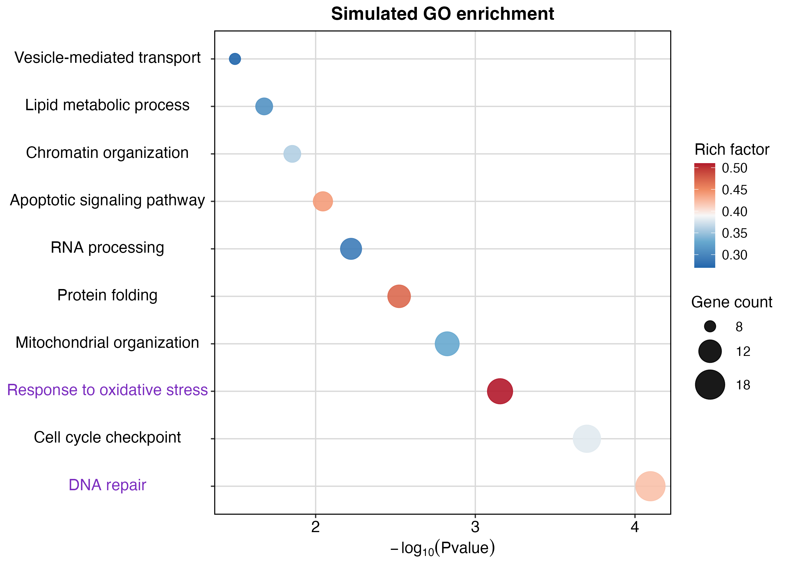
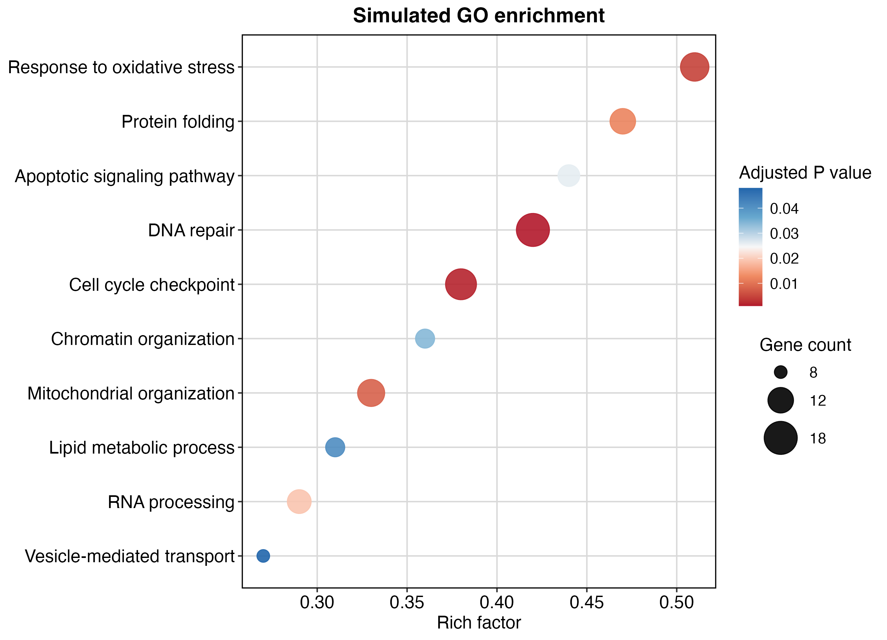
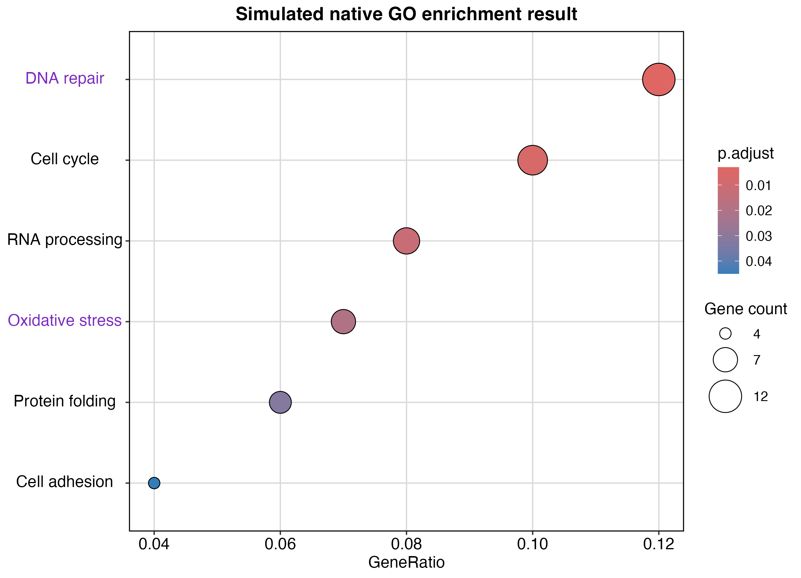

# 用 `GO_KEGG_plot()` 绘制 GO/KEGG 富集气泡图

本教程使用一组模拟富集结果，演示如何只调用 `BioInfoAfterSale::GO_KEGG_plot()` 绘制两种常见气泡图：横轴为 `-log10(P value)`，以及横轴为 `RichFactor` 或 `GeneRatio`。教程还包括 Gene count 三档图例和指定通路标签强调。

> 模拟数据只用于演示绘图接口，不代表真实 GO 或 KEGG 富集结果。

## 准备工作

首次使用时从 GitHub 安装 R 包：

```r
if (!requireNamespace("remotes", quietly = TRUE)) {
  install.packages("remotes")
}

remotes::install_github("DengXinyin/BioInfo_AfterSale")
```

载入包并创建结果目录：

```r
library(BioInfoAfterSale)

dir.create("go_kegg_results", recursive = TRUE, showWarnings = FALSE)
```

## 第 1 步：准备模拟富集结果

普通数据框至少需要提供绘图参数引用的列。本例使用：

- `Description`：GO 条目或 KEGG 通路名称；
- `pvalue`：原始 P 值；
- `p.adjust`：多重检验校正后的 P 值；
- `RichFactor`：命中基因数占该通路背景基因数的比例；
- `Count`：命中该条目或通路的基因数。

```r
enrichment_table <- data.frame(
  Description = c(
    "DNA repair",
    "Cell cycle checkpoint",
    "Response to oxidative stress",
    "Mitochondrial organization",
    "Protein folding",
    "RNA processing",
    "Apoptotic signaling pathway",
    "Chromatin organization",
    "Lipid metabolic process",
    "Vesicle-mediated transport",
    "Cell adhesion",
    "Immune response"
  ),
  pvalue = c(
    0.00008, 0.0002, 0.0007, 0.0015, 0.003, 0.006,
    0.009, 0.014, 0.021, 0.032, 0.046, 0.071
  ),
  p.adjust = c(
    0.0010, 0.0018, 0.0045, 0.0080, 0.012, 0.019,
    0.026, 0.034, 0.041, 0.048, 0.061, 0.093
  ),
  RichFactor = c(
    0.42, 0.38, 0.51, 0.33, 0.47, 0.29,
    0.44, 0.36, 0.31, 0.27, 0.24, 0.22
  ),
  Count = c(18, 16, 14, 13, 12, 11, 10, 9, 9, 8, 7, 6),
  stringsAsFactors = FALSE
)
```

## 第 2 步：绘制 P 值气泡图

横轴使用 `-log10(P value)`。越靠右表示 P 值越小；点的大小表示命中基因数，颜色表示 Rich factor。

```r
BioInfoAfterSale::GO_KEGG_plot(
  result = enrichment_table,
  plot_type = "dotplot",
  filter_by = "p.adjust",
  cutoff = 0.05,
  show_category = 10,
  x = "pvalue",
  x_transform = "neg_log10",
  color = "RichFactor",
  label = "Description",
  size = "Count",
  order_by = "pvalue",
  decreasing = FALSE,
  title = "Simulated GO enrichment",
  font_family = "sans",
  base_size = 13,
  x_label = expression(-log[10](Pvalue)),
  color_label = "Rich factor",
  size_label = "Gene count",
  color_palette = c(
    "#2166AC", "#67A9CF", "#F7F7F7", "#EF8A62", "#B2182B"
  ),
  size_range = c(4, 11),
  point_alpha = 0.9,
  highlight_terms = c("DNA repair", "Response to oxidative stress"),
  highlight_color = "#7B2CBF",
  highlight_bold = TRUE,
  output_file = "go_kegg_results/go_pvalue_dotplot.png",
  figure_width = 9,
  figure_height = 6.5,
  dpi = 300
)
```



`Gene count` 默认从当前展示的数据中选择最多三个代表值。指定的两个通路名称显示为紫色粗体。

## 第 3 步：绘制 Rich factor 气泡图

第二种常见形式把富集比例放在横轴，颜色映射校正后的 P 值。

```r
BioInfoAfterSale::GO_KEGG_plot(
  result = enrichment_table,
  plot_type = "dotplot",
  filter_by = "p.adjust",
  cutoff = 0.05,
  show_category = 10,
  x = "RichFactor",
  x_transform = "identity",
  color = "p.adjust",
  label = "Description",
  size = "Count",
  order_by = "RichFactor",
  decreasing = TRUE,
  title = "Simulated GO enrichment",
  font_family = "sans",
  base_size = 13,
  x_label = "Rich factor",
  color_label = "Adjusted P value",
  size_label = "Gene count",
  color_palette = c(
    "#B2182B", "#EF8A62", "#F7F7F7", "#67A9CF", "#2166AC"
  ),
  output_file = "go_kegg_results/go_richfactor_dotplot.png",
  figure_width = 9,
  figure_height = 6.5,
  dpi = 300
)
```



在这张图中，越靠右表示富集比例越高。颜色图例中较小的校正 P 值使用红色，较大的值使用蓝色。

## 第 4 步：手动指定 Gene count 三档数值

默认自动选择通常已经够用。如果报告需要固定刻度，可以显式传入三个值：

```r
BioInfoAfterSale::GO_KEGG_plot(
  result = enrichment_table,
  filter_by = "p.adjust",
  cutoff = 0.05,
  x = "RichFactor",
  color = "p.adjust",
  size = "Count",
  size_breaks = c(8, 12, 18)
)
```

如果实际 Count 范围不同，应根据自己的数据修改这三个数值。

绘图筛选严格保留 `0 < p < cutoff`。因此差异结果按原始 P 值筛选时，
`p < 0.05 且 p > 0` 才会进入图形；`p = 0` 会被排除并发出提示，因为它
通常表示数值下溢或低于检测下限，不能直接当作真实的零概率。

如果只想放大横轴局部而不改变输入数据，可以使用 `x_zoom`；`x_limits` 则
明确表示按范围过滤绘图数据：

```r
BioInfoAfterSale::GO_KEGG_plot(
  enrichment_table,
  filter_by = "pvalue",
  cutoff = 0.05,
  x = "pvalue",
  x_transform = "neg_log10",
  color = "RichFactor",
  x_zoom = c(1, 6)
)
```

## 第 5 步：绘制原生 `enrichResult`

`GO_KEGG_analyse()` 和 `clusterProfiler` 返回的通常是 `enrichResult` 对象。这类对象中的 `GeneRatio` 常采用 `"12/100"` 形式，`GO_KEGG_plot()` 会交给 `enrichplot` 正确解析。

```r
BioInfoAfterSale::GO_KEGG_plot(
  result = go_enrich_result,
  plot_type = "dotplot",
  filter_by = "p.adjust",
  cutoff = 0.05,
  show_category = 15,
  x = "GeneRatio",
  color = "p.adjust",
  size_breaks = c(4, 7, 12),
  highlight_terms = c("DNA repair", "Oxidative stress"),
  highlight_color = "#7B2CBF",
  highlight_bold = TRUE,
  output_file = "go_kegg_results/go_native_dotplot.png",
  figure_width = 9,
  figure_height = 6.5
)
```



普通数据框中的 `GeneRatio` 需要是数值列；如果它仍然是 `"12/100"` 字符串，建议使用原生 `enrichResult`，或者先在数据整理阶段转换为数值。

## 检查结果

```r
file.exists("go_kegg_results/go_pvalue_dotplot.png")
file.info("go_kegg_results/go_pvalue_dotplot.png")$size
```

第一条命令应返回 `TRUE`，第二条命令应返回大于 0 的文件大小。

## 常见问题

### 没有通路通过筛选

如果出现 `No enrichment terms remain for plotting`，检查 `filter_by` 和 `cutoff`。例如暂时保留全部输入行：

```r
BioInfoAfterSale::GO_KEGG_plot(
  result = enrichment_table,
  filter_by = NULL,
  x = "RichFactor",
  color = "pvalue"
)
```

### 指定的通路没有被强调

`highlight_terms` 与 `Description` 采用精确匹配，而且只能强调经过筛选并进入 `show_category` 的通路。函数会对未显示的指定通路发出提醒。

```r
setdiff(
  c("DNA repair", "Oxidative stress"),
  enrichment_table$Description
)
```

正常情况下应返回 `character(0)`。

### 自定义 Gene count 刻度没有出现在图例中

确保 `size_breaks` 位于实际 `Count` 范围内。省略该参数即可恢复自动三档：

```r
BioInfoAfterSale::GO_KEGG_plot(
  result = enrichment_table,
  x = "RichFactor",
  color = "p.adjust",
  size_breaks = NULL
)
```

## 你完成了什么

你已经使用同一个 `GO_KEGG_plot()` 接口绘制了 P 值、Rich factor 和 GeneRatio 三种横轴表达方式，并控制了显著性筛选、气泡大小、颜色、三档 Gene count 图例以及重点通路标签。

图形设计参考了 [Bizard 富集分析可视化案例](https://openbiox.github.io/Bizard/)，具体参数已适配 `BioInfoAfterSale::GO_KEGG_plot()`。
