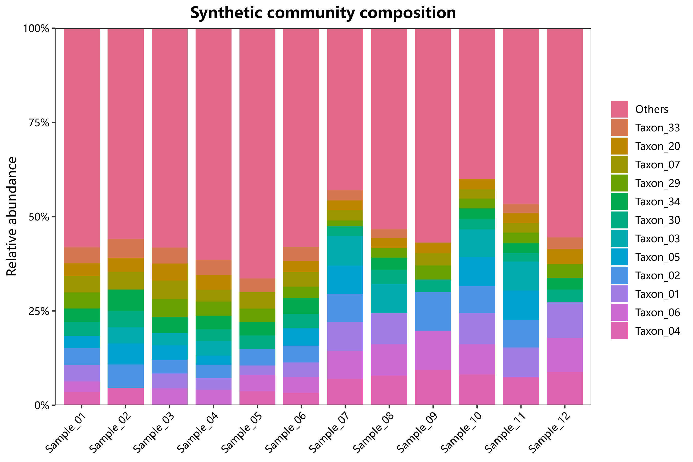

# 01 群落组成

对应 R 文件：`micro/R/01_composition.R`。

- `micro_abundance_bar()`：Top N 堆叠丰度柱状图，可按组取均值。
- `micro_abundance_heatmap()`：丰度或行 Z-score 热图。
- `micro_clustered_abundance_bar()`：按群落距离聚类后的样本顺序绘图。

```r
source("micro/R/utils.R")
source("micro/R/01_composition.R")
p <- micro_abundance_bar(abundance, group, top_n = 12)
micro_save_plot(p, "composition.png")
```

示例图：
