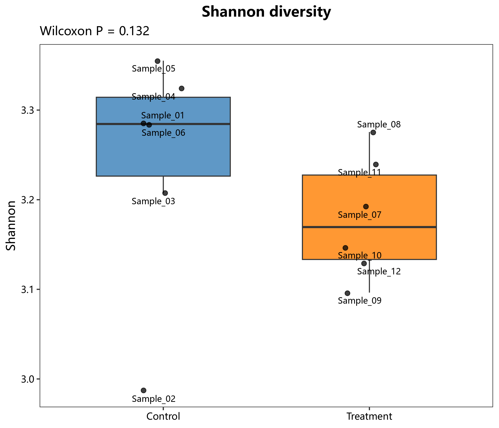

# 02 Alpha 多样性与抽样充分性

对应 R 文件：`micro/R/02_alpha_diversity.R`。

提供 Alpha 指数箱线图、稀释曲线、Rank-abundance 和物种累积曲线。两组默认 Wilcoxon，
多组默认 ANOVA；统计方法可显式指定，避免混淆原始 P 值和校正 P 值。

```r
res <- micro_species_accumulation(abundance)
micro_save_plot(res$plot, "species_accumulation.png")
```

示例图：
