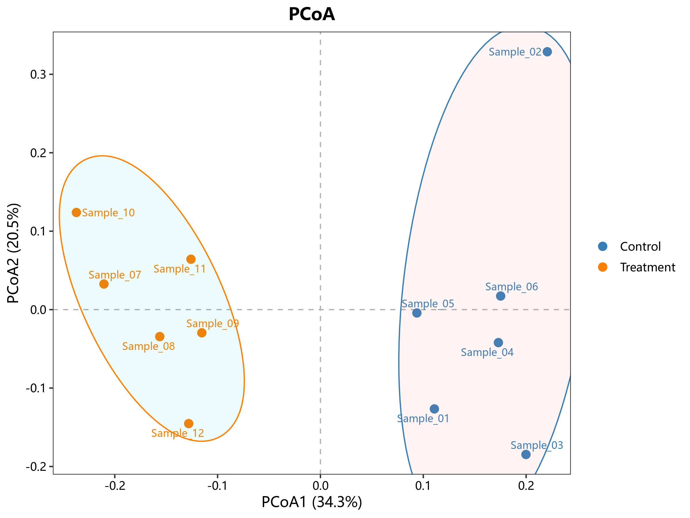

# 03 排序与距离

对应 R 文件：`micro/R/03_ordination.R`。

`micro_ordination()` 统一 PCA、PCoA 和 NMDS，返回 `plot`、样本坐标、模型与解释度。
PCoA/NMDS 默认用 Bray-Curtis；小样本不强制画统计椭圆，只有传入 `ellipse = TRUE`
才启用。`micro_distance_heatmap()` 接受 `dist` 或方阵。

```r
ord <- micro_ordination(abundance, group, method = "PCoA", labels = TRUE)
micro_save_plot(ord$plot, "pcoa.png")
```

示例图：
