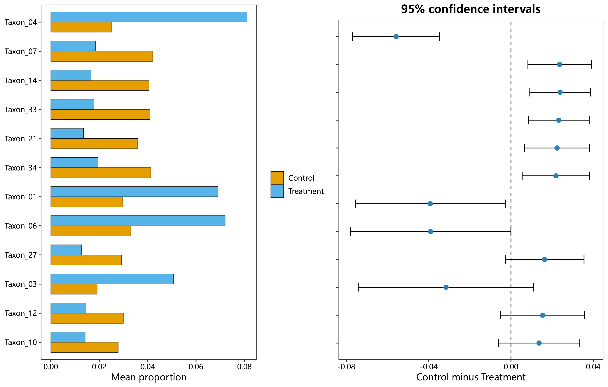

# 04 差异与特征筛选

对应 R 文件：`micro/R/04_differential.R`。

- `micro_diff_boxplot()`：指定特征的组间箱线图。
- `micro_stamp_plot()`：两组均值、差值、95% CI 和校正 P 值。
- `micro_random_forest_plot()`：随机森林特征重要性。
- `micro_lda_score_plot()`：从已有 marker 表绘制 LDA 条形图。

```r
stamp <- micro_stamp_plot(abundance, group, adjust = "BH", top_n = 12)
micro_save_plot(stamp$plot, "stamp.png", width = 11)
stamp$statistics
```

示例图：
