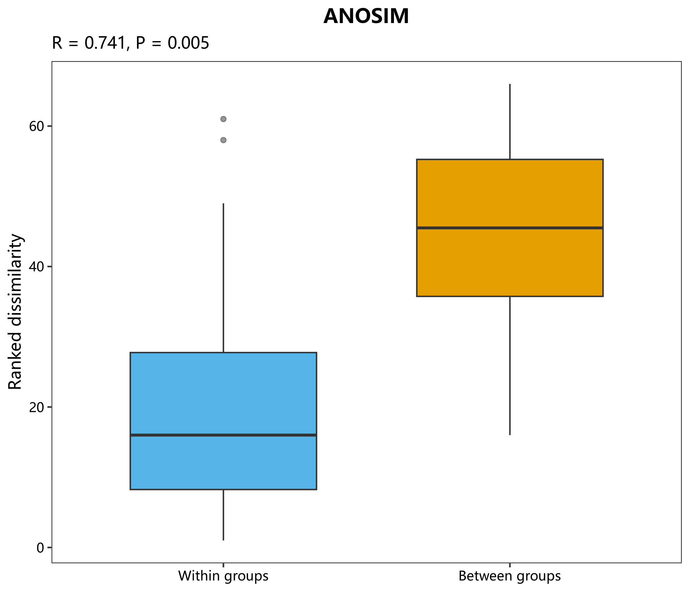

# 05 Beta 多样性统计

对应 R 文件：`micro/R/05_beta_statistics.R`。

`micro_beta_test()` 统一 ANOSIM、PERMANOVA (`adonis2`) 和 MRPP；
`micro_anosim_plot()` 返回模型和组内/组间距离秩箱线图。置换次数和随机种子均可配置。

```r
d <- vegan::vegdist(t(abundance), method = "bray")
res <- micro_anosim_plot(d, group, permutations = 999)
micro_save_plot(res$plot, "anosim.png")
```

示例图：
