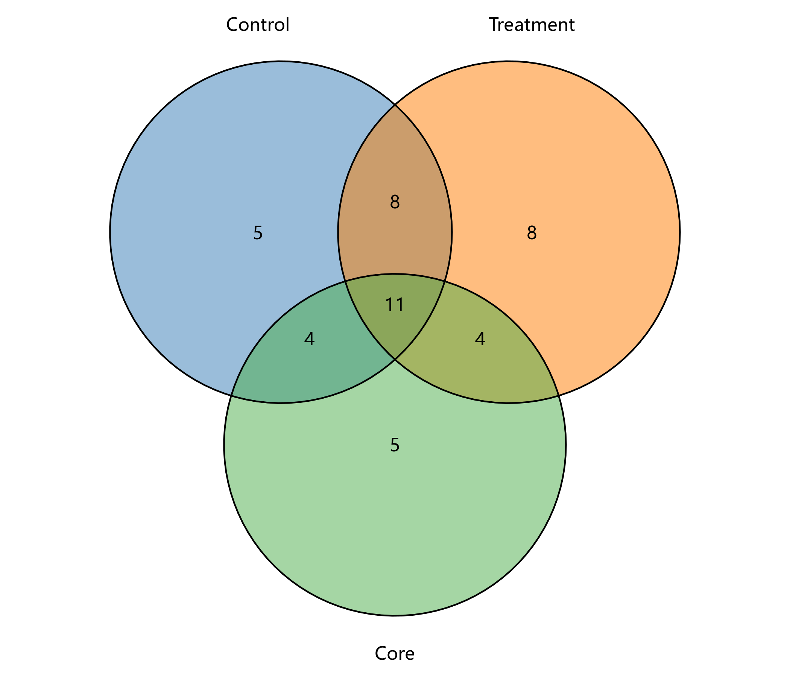

# 06 集合与网络

对应 R 文件：`micro/R/06_overlap_network.R`。

提供 2–4 集合 Venn 图、相关网络图及 Zi-Pi 节点角色图。网络输入至少包含 Source、Target，
Weight 可为正负相关系数。网络函数返回绘图函数和 `igraph` 对象，方便继续调整。

```r
p <- micro_overlap_plot(list(Group_A = taxa_a, Group_B = taxa_b, Group_C = taxa_c))
micro_save_plot(p, "venn.png")
```

示例图：
