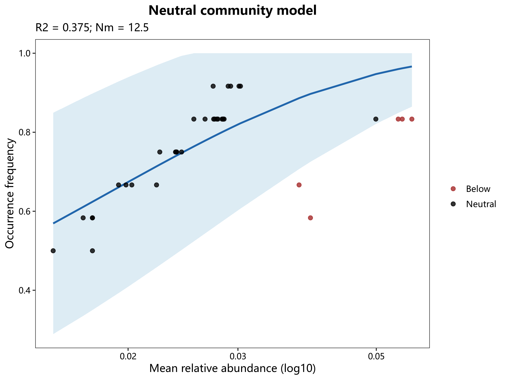

# 07 特殊图

对应 R 文件：`micro/R/07_special_plots.R`。

`micro_length_distribution()` 绘制代表序列长度分布；`micro_ncm_fit()` 和
`micro_ncm_plot()` 拟合并绘制中性群落模型，返回坐标、模型参数、R²、m 和 N。

```r
fit <- micro_ncm_fit(abundance)
p <- micro_ncm_plot(fit)
micro_save_plot(p, "ncm.png")
```

示例图：
